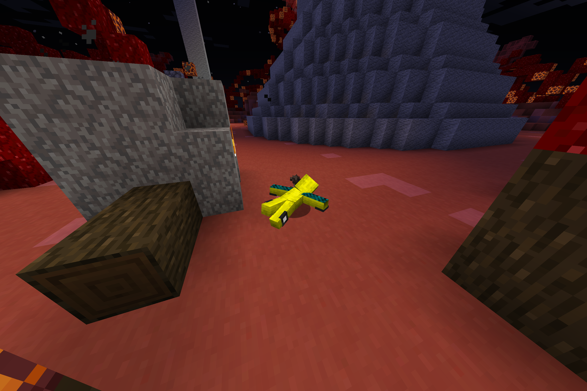
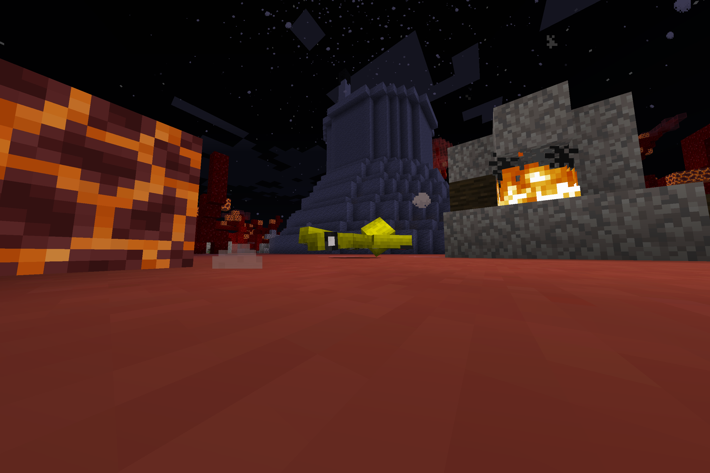

# ？

我是 E-13c1b[1] 型星球探索机器人。随着母星环境急剧恶化，越发不适宜居住，抱着对浩瀚宇宙的期许，包含我在内的 20c187a 台机器人被送往宇宙。

## ？？

我的飞行方向是 `[-0.6915302276611328d, 0.5897536277770996d, 0.4171050190925598d]`。在经历了 1ab05192 个时间单位以后，终于着陆，来到了目的星球。

与我们幻想中的美好星球全然不同，这鬼地方比地狱还要地狱：气体中 SOx 与 NOx 含量奇高，地表温度甚至达到了 526 个温度单位。我向母星发出「不易居住」的信号以后，便算是完结了我的任务。根据母星那边的回应，似乎已经到达目的星球的 194c854 台机器人发出的均为「不易居住」。如此浩瀚宇宙竟然找不到一个未被利用的星球了？不过母星那边的事，已经与我这个探测器无关了。

## ！！

还有那么一点能量，无事可做，学习了一下这个星球上生命体的语言[2]。第三代住民称这里为「地球」，它曾是个像原来的母星那样美丽的星球。我把这段日志刻到了石头上，说不定以后又会有来自哪个星球的生命体看到呢？

E-13c1b

公元纪元 206c 年

------

## 注

[1] 母星生命体使用 13 进制表示数字。在后来阅读地球上的 10 进制数字时，它们没有感受到任何不对劲。

[2] 全世界都说中文。

